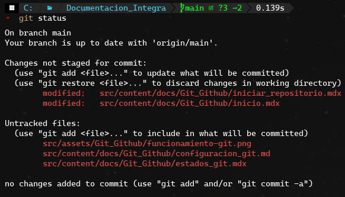

En Git, los archivos pueden encontrarse en diferentes estados a lo largo de su ciclo de vida.
para ver el estado de los archivos del repositorio se usa el comando:

```bash 
git status
```


## Los estados principales de los archivos en Git 
### Untracked (No rastreado)
Son archivos que están en el directorio de trabajo pero que Git no está rastreando. Estos archivos no forman parte del control de versiones hasta que se agregan al área de preparación (staging area) con `git add`.
### Staged (Preparado)
Son archivos que han sido agregados al área de preparación con `git add`. Estos archivos están listos para ser confirmados (committed) en el repositorio.
### Modified (Modificado)
Son archivos que han sido cambiados en el directorio de trabajo pero que aún no han sido agregados al área de preparación. Estos cambios no serán incluidos en la próxima confirmación a menos que se agreguen con `git add`.
### Committed (Confirmado) 
Son archivos que han sido confirmados en el repositorio. Estos archivos forman parte del historial de versiones y sus cambios están guardados de forma segura en el repositorio.
